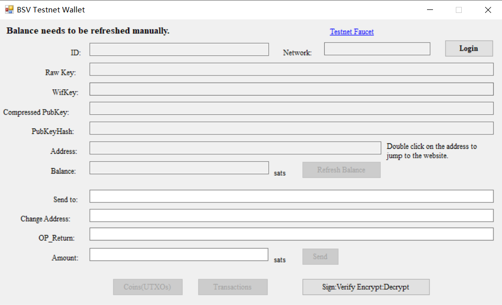
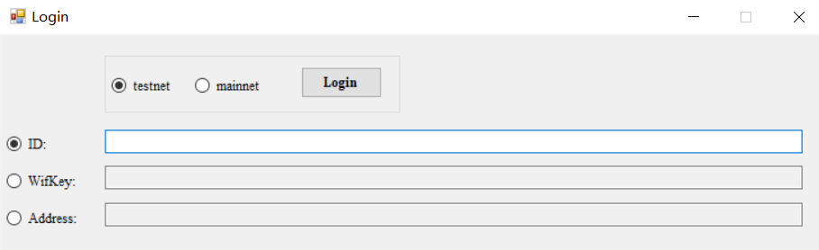

BSV Testnet Wallet. Ready to use after unzipping. Connects to BSV testnet using whatsonchain.com APIs. A BSV testnet faucet link. Supports three login types.
ver 0.1.2.1 uses BsvSimpleLibrary 0.2.5.1 align with the updated whatsonchain.com  REST API schema.

